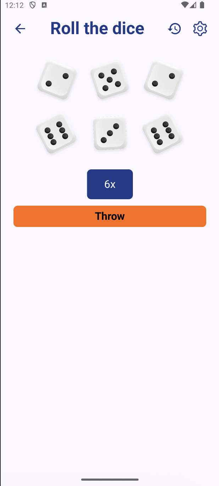

# 🎲 Roll It! – Randomizer App

**Roll It!** is a sleek and lightweight Android app built with **Jetpack Compose** that helps you  
add a pinch of randomness to your life.  
Whether you need to roll dice, pick a random number, or select an item from a list – Roll It! has you covered.

---

## 📑 Table of Contents
- [✨ Features](#-features)
- [📱 Screenshots](#-screenshots)
- [🛠 Tech Stack](#-tech-stack)
- [📦 Installation](#-installation)
- [🚀 Usage](#-usage)
- [📄 License](#-license)

---

## ✨ Features

### 🎲 Dice Roller
- Roll one or multiple **D6** dice at once.
- Add a custom modifier (bonus/penalty: `+2`, `-1`, etc.).
- Save frequently used roll presets (e.g. `2D6+1`).
- View detailed results for each die and the total sum.
- Simple dice roll animation for extra fun.

### 🔢 Random Number Generator
- Generate a random number in a custom range (`Min` / `Max`).
- Option to generate **multiple numbers** at once.
- "No repeats" mode when generating multiple values.
- Save favorite ranges for quick access.

### 📋 Random List Picker
- Create your own lists (one item per line or comma-separated).
- Save lists for repeated use.
- Pick one random item from the list.
- Optional **Shuffle** entire list.
- Remove selected items to avoid repeats.
- Split list into **X groups** (e.g. for team assignments).

### 📜 History & Saved Items
- View history of recent rolls, generated numbers, and list picks.
- Access saved dice roll presets, number ranges, and lists.

### ⚙️ Settings
- Enable/disable animations.
- Switch between light and dark themes.
- Enable/disable sound and vibration feedback.
- Quick help & usage tips.

---

## 📱 Screenshots

| Main menu                              | Generate Number                                     | Dice Roller                               | Settings                              | History                             |
|----------------------------------------|-----------------------------------------------------|-------------------------------------------|---------------------------------------|-------------------------------------|
|  |  |  |  |  |

---

## 🛠 Tech Stack
- **Kotlin** – main programming language.
- **Jetpack Compose** – UI toolkit.
- **Room** – local database for storing presets, ranges, and lists.
- **DataStore Preferences** – lightweight storage for app settings.
- **Koin** – dependency injection.
- **Coil** – image loading & GIF support.

---

